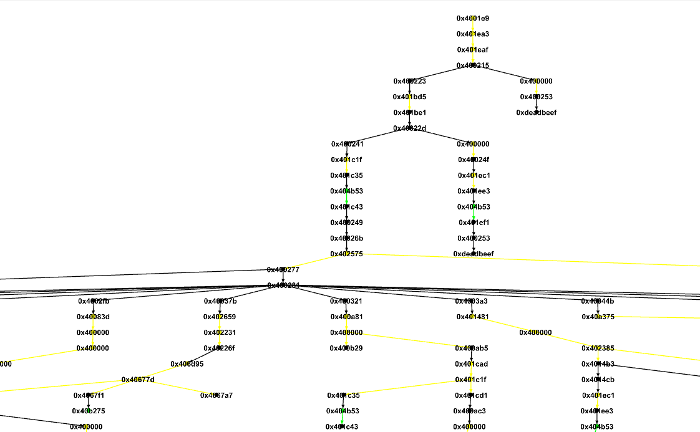

## SimgrViz

This exploration technique dumps the successors of a given state and build the dynamic control flow graph of the program while 
symbolically executing it. 
The final result can be exported in a .dot file and visualized with [Gephi](https://gephi.org/) or any other tool that supports the DOT format.
Node information can be enriched with attributes of the state for a post-mortem analysis of what happened during the symbolic execution.

*HINT*: Plug this ET as the last ET of your SimulationManager.

Do dump the .dot file use

```
import networkx as nx

# G is the networkx graph object 
nx.write_dot(G,"my_simgr.dot")
```

Here an example of the graph when visualized with Gephi.


